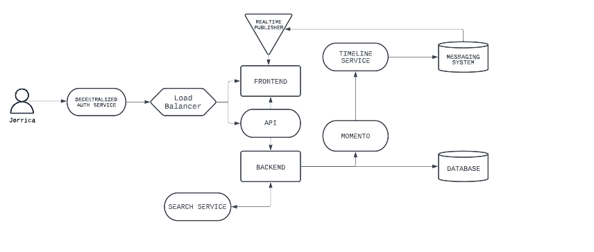
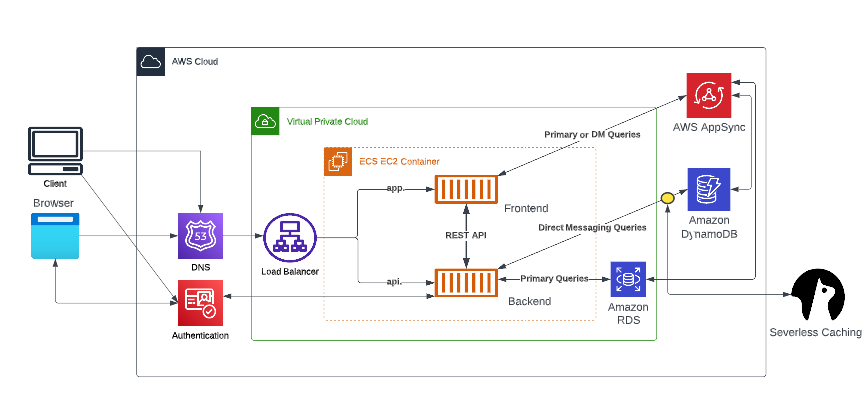
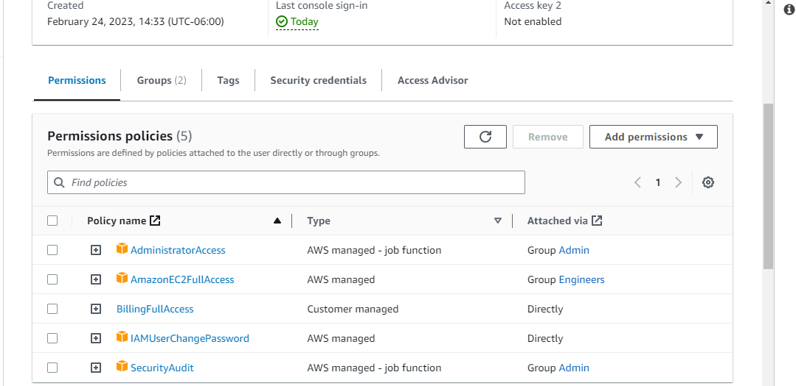
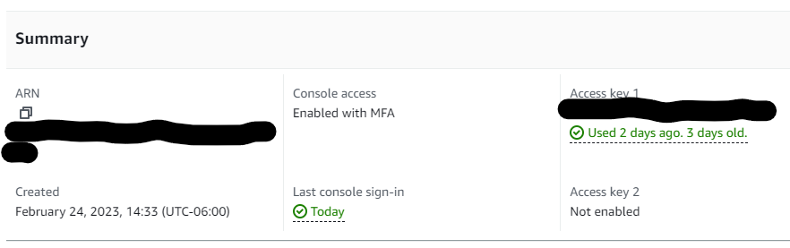
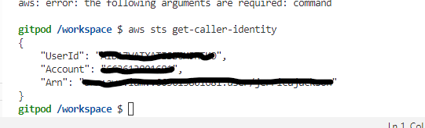
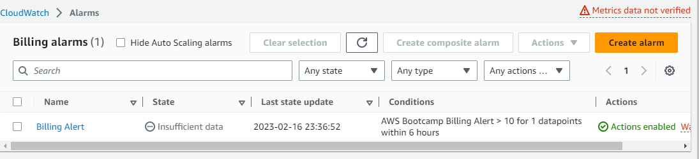

# Week 0 - Billing and Architecture

## Homework Hard Assignments

- Watched Week 0 - Live Streamed Video :heavy_check_mark:
- Watched Chirag's Week 0 - Spend Considerations :heavy_check_mark:
- Watched Ashish's Week 0 - Security Considerations :heavy_check_mark:
- Recreate Conceptual Diagram in Lucid Charts or on a Napkin :heavy_check_mark:
- Recreate Logical Diagram in Lucid Charts :heavy_check_mark:
- Create an Admin User :heavy_check_mark:
- Use CloudShell :heavy_check_mark:
- Generate AWS Credentials :heavy_check_mark:
- Installed AWS CLI :heavy_check_mark:
- Create a Billing Alarm :heavy_check_mark:
- Create a Budget :heavy_check_mark:

### Recreate Conceptual Diagram in Lucid Charts or on a Napkin

**[Conceptual Diagram]( https://lucid.app/lucidchart/ec2af634-d9c9-449e-98f2-5c508fc62826/edit?viewport_loc=-19%2C-16%2C1480%2C639%2C0_0&invitationId=inv_f7c93fff-c7b7-4b25-84bb-67c52fa34b16)**

### Recreate Logical Architectural Diagram in Lucid Charts

**[Logical Diagram](https://lucid.app/lucidchart/b074e5d6-c674-4ef8-932e-fa07e2b439a8/edit?viewport_loc=467%2C307%2C1480%2C639%2C0_0&invitationId=inv_7e458e24-36ea-4426-8d26-d226b7ce1646)**

### Create an Admin User

### Using CloudShell

### Generating AWS Credentials

### Installed AWS CLI

### Create a Billing Alarm

### Create a Budget

